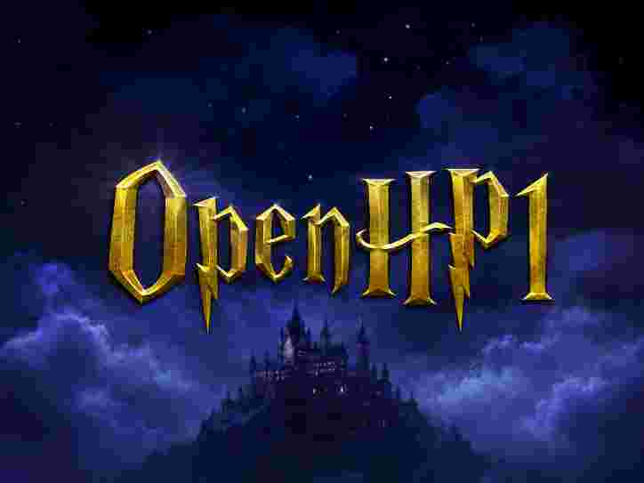

# Open Harry Potter 1

> An open-source re-implementation of the first Harry Potter game.



OpenHP1 requires the original game files to run.

## Installation

This is heavily work-in-progress, and no pre-built binaries are available yet.
For building the game yourself, please refer to the [Development](#development) section below.

## Development

### Prerequisites

Place the original game files in the `res/` directory. It should look something like this:
```
res/
├── Maps/
│   ├── Lev_Tut1.unr
│   ├── Lev_Tut2.unr
│   └── ...
├── Music/
├── Sounds/
├── ...
```

You will also need a modern Rust toolchain installed. You can install Rust with [rustup](https://rustup.rs/).

### Map Viewer
The OpenHP1 viewer is a cross-platform, real-time 3D renderer for the original Harry Potter 1 maps and actors.
It does not implement the full game logic, but it lets you fly through the original levels and inspect the actors, meshes, and textures.

You can build and run the viewer with:

```sh
cargo run -p openhp1-viewer -- res/Maps/Lev_Tut1.unr # debug build
cargo run --release -p openhp1-viewer -- res/Maps/Lev_Tut1.unr # release build
```

Drag over the viewport to look around. Use `WASD` to move, `Q`/`E` to move
down/up, and hold Shift to move faster. The Actors panel searches the current
level's actors and shows their identity, decoded state, render ranges, and
diagnostics. You can switch levels within the viewer.

### Game
The OpenHP1 game is a re-implementation of the original game logic. It intends to faithfully reproduce the original gameplay.

You can build and run the game with:

```sh
cargo run -p openhp1-game # debug build
cargo run --release -p openhp1-game # release build
```

Hold + (main keyboard or numpad) or F to run the normal game simulation at 16x speed. This debug
fast-forward still processes scripts, animation completions, triggers, and
other runtime events in order.

### Docs

See [`docs/`](docs/) for the reverse-engineered package, map, texture, and
rendering notes.

### Resources

Original game data belongs in the gitignored `res/` directory and must not be committed.
To not distribute the original game data, as that constitutes copyright infringement.
